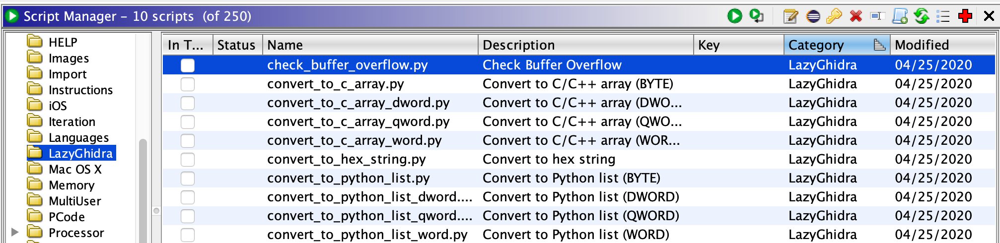

# LazyGhidra
Make your Ghidra Lazy! LazyGhidra is inspired by [LazyIDA](https://github.com/L4ys/LazyIDA).

## Installation

In the Script Manager click the `Script Directories` icon in the toolbar and add the checked out the `scripts` folder in this repository as a path.
Scripts will appear in the `LazyGhidra` category.

## Features 
- Convert selected data into different formats:
  - hex string
  - C/C++ array
  - Python list

This convert selected part of `Listing` to various formats.

When conversion is complete, scripts output the result to `Console`.

- Check potentially buffer overflow functions:
  - getpw
  - gets
  - sprintf
  - strcat
  - strcpy
  - vsprinf

The results are output to `Console`.

It is also reflected in `Bookmarks`.

